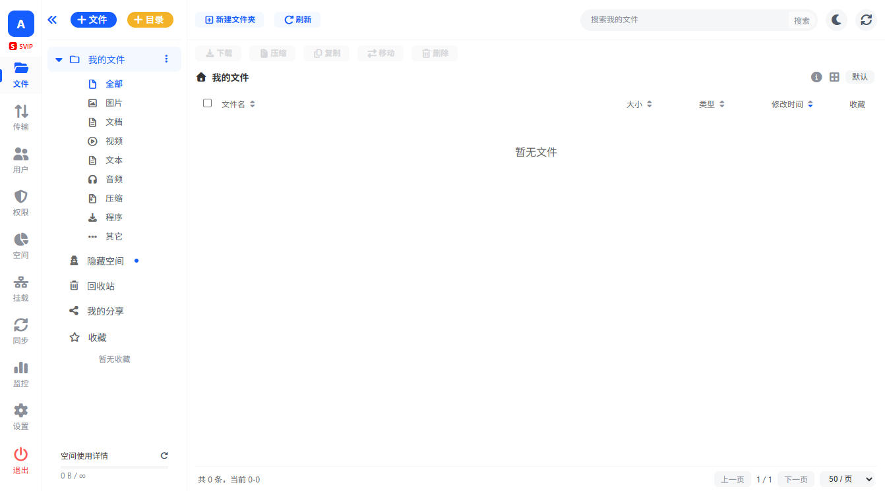

# JockCloud 云盘系统 - 安装与使用指南

## 项目简介

JockCloud 是一个基于 Node.js + Express + MySQL 构建的私有云盘系统，支持文件上传、下载、分享、同步、用户权限管理等功能。



### 主要功能

-  **文件管理**：上传、下载、删除、重命名、移动、复制、解压缩（zip/rar/7z 等）
-  **用户管理**：用户注册、用户组管理、角色权限控制（管理员/普通用户）
-  **文件分享**：创建分享链接、设置提取码、有效期管理
-  **文件同步**：本地文件夹与云端双向同步、增量同步、冲突处理
-  **配额管理**：用户/用户组存储空间配额、上传数量限制
-  **回收站**：软删除机制、30 天自动清理、一键恢复
-  **响应式设计**：支持 PC 端和移动端自适应
-  **深色模式**：支持深色/浅色/自动主题切换
-  **系统监控**：CPU、内存、磁盘、网络实时监控
-  **云存储挂载**：支持阿里云 OSS、腾讯云 COS、七牛云作为存储后端
-  **安全机制**：请求速率限制、短信验证码、登录会话管理

## 环境要求

### 必需环境

- **Node.js**: >= 14.x（推荐使用最新 LTS 版本，如 Node.js 18.x 或 20.x）
- **MySQL**: >= 5.7 或 MariaDB >= 10.2
- **npm**: >= 6.x（或使用 yarn/pnpm）

### 可选服务

- **阿里云短信服务**：用于短信验证码登录功能
- **云存储挂载**：
  - 阿里云 OSS
  - 腾讯云 COS
  - 七牛云 Kodo

## 安装步骤

### 1. 安装依赖

```bash
npm install
```

### 2. 配置环境变量

复制 `.env.example` 到 `.env` 文件并根据实际情况修改配置：

```bash
# 数据库配置
DB_HOST=
DB_PORT=
DB_USER=
DB_PASSWORD=
DB_NAME=

# 服务器配置
PORT=3000
HOST=0.0.0.0

# 阿里云短信服务配置（ 个人可用 - 阿里云号码认证（https://dypns.console.aliyun.com/smsServiceOverview））
# 阿里云号码认证
DYPNS_ACCESS_KEY_ID=你的 AccessKey ID
DYPNS_ACCESS_KEY_SECRET=你的 AccessKey Secret
DYPNS_REGION=cn-hangzhou
DYSMS_SIGN_NAME=你的短信签名
DYSMS_TEMPLATE_ID=你的短信模板 ID
```

### 3. 初始化数据库

在 MySQL 中创建数据库，系统会在首次启动时自动创建表结构。

**注意**：首次启动时会自动创建管理员账户：
- 用户名：`admin`
- 密码：`admin`

**请务必在首次登录后立即修改密码！**

### 4. 启动服务

#### 开发环境

```bash
npm run dev
```

#### 生产环境

```bash
npm start
```

启动成功后，访问 `http://localhost:3000` 即可使用。

## 目录结构

```
jockcloud/
├── src/                      # 后端源代码目录
│   ├── app.js               # Express 应用主入口
│   ├── db.js                # MySQL 数据库连接与初始化
│   ├── routes/              # API 路由定义
│   │   ├── auth.js          # 认证相关路由
│   │   ├── entries.js       # 文件/文件夹管理
│   │   ├── uploads*.js      # 上传相关路由
│   │   ├── downloads.js     # 下载相关路由
│   │   ├── shares.js        # 分享功能
│   │   ├── sync-tasks.js    # 同步任务
│   │   ├── mounts.js        # 云存储挂载
│   │   ├── users.js         # 用户管理
│   │   ├── settings.js      # 系统设置
│   │   └── ...
│   ├── services/            # 业务逻辑服务层
│   │   ├── auth-runtime.js  # 认证运行时
│   │   ├── upload-middlewares.js  # 上传中间件
│   │   ├── sync-service.js  # 同步服务
│   │   └── ...
│   ├── middlewares/         # Express 中间件
│   │   ├── auth.js          # 认证中间件
│   │   ├── rate-limit.js    # 限流中间件
│   │   └── error-handler.js # 错误处理
│   ├── jobs/                # 定时任务
│   │   ├── recycle-cleanup.job.js  # 回收站清理
│   │   ├── runtime-cleanup.job.js  # 运行时清理
│   │   └── sync-scheduler.job.js   # 同步调度
│   └── utils/               # 工具函数
│       ├── config.js        # 配置加载
│       ├── constants.js     # 常量定义
│       ├── settings-db.js   # 设置数据库操作
│       └── ...
├── views/                    # 前端视图模板
│   ├── js/                  # 前端 JavaScript（未压缩版本）
│   ├── components/          # HTML 组件片段
│   └── *.html               # 页面模板
├── public/                   # 静态资源目录
│   ├── css/                 # 样式文件
│   ├── js/                  # 公共脚本
│   └── avatar/              # 默认头像 SVG
├── uploads/                  # 本地文件上传存储
│   ├── admin-1/             # 用户文件目录
│   └── avatar/              # 用户头像存储
├── logs/                     # 日志目录
│   ├── app.log              # 应用日志
│   └── error.log            # 错误日志
├── .env                      # 环境变量配置文件
├── package.json             # Node.js 项目配置
├── server.js                # 服务器启动入口
└── README.md                # 项目文档
```

## 主要 API 路由

### 认证相关
- `POST /api/auth/login` - 用户登录
- `POST /api/auth/logout` - 用户登出
- `POST /api/auth/register` - 用户注册
- `POST /api/auth/captcha` - 获取验证码
- `POST /api/auth/sms-code` - 获取短信验证码

### 文件管理
- `GET /api/entries` - 获取文件列表
- `POST /api/entries` - 创建文件/文件夹
- `PUT /api/entries/:id` - 更新文件信息
- `DELETE /api/entries/:id` - 删除文件
- `POST /api/entries/move` - 移动文件
- `POST /api/entries/copy` - 复制文件

### 上传下载
- `POST /api/uploads` - 上传文件
- `GET /api/downloads/:id` - 下载文件
- `POST /api/upload-tasks` - 创建上传任务
- `GET /api/upload-tasks` - 获取上传任务列表

### 分享功能
- `GET /api/shares` - 获取分享列表
- `POST /api/shares` - 创建分享
- `DELETE /api/shares/:id` - 删除分享
- `GET /api/shares/:token` - 获取分享详情

### 回收站
- `GET /api/recycle` - 获取回收站文件
- `POST /api/recycle/restore` - 恢复文件
- `DELETE /api/recycle` - 彻底删除

### 用户管理
- `GET /api/users` - 获取用户列表
- `POST /api/users` - 创建用户
- `PUT /api/users/:id` - 更新用户信息
- `DELETE /api/users/:id` - 删除用户
- `GET /api/profile` - 获取当前用户信息
- `PUT /api/profile` - 更新当前用户信息

### 系统管理
- `GET /api/admin-stats` - 获取系统统计信息
- `GET /api/system-monitor` - 系统监控
- `GET /api/online-users` - 在线用户
- `GET /api/storage-meta` - 存储元信息
- `GET /api/settings` - 获取系统设置
- `PUT /api/settings` - 更新系统设置

### 同步功能
- `GET /api/sync-tasks` - 获取同步任务列表
- `POST /api/sync-tasks` - 创建同步任务
- `PUT /api/sync-tasks/:id` - 更新同步任务
- `DELETE /api/sync-tasks/:id` - 删除同步任务

## 系统配置说明

### 环境变量配置

以下环境变量在 `.env` 文件中配置，**应用启动时读取**：

**必需配置**：
- `DB_HOST` - MySQL 数据库地址
- `DB_PORT` - MySQL 数据库端口
- `DB_USER` - 数据库用户名
- `DB_PASSWORD` - 数据库密码
- `DB_NAME` - 数据库名称
- `PORT` - 服务端口（默认：3000）
- `HOST` - 服务监听地址（默认：0.0.0.0）

**可选配置**：
- `DYPNS_ACCESS_KEY_ID` - 阿里云 AccessKey ID（短信验证码）
- `DYPNS_ACCESS_KEY_SECRET` - 阿里云 AccessKey Secret
- `DYSMS_REGION` - 阿里云短信服务区域
- `DYSMS_SIGN_NAME` - 短信签名
- `DYSMS_TEMPLATE_ID` - 短信模板 ID
- `MAX_UPLOAD_FILE_SIZE_MB` - 默认最大上传文件大小（MB，默认：10240）

**注意**：短信配置优先级为：系统设置界面配置 > 环境变量 > 默认值

### 代码常量配置

以下配置为代码中的**固定常量**，如需修改需更改源代码：

- `RECYCLE_RETENTION_DAYS` - 回收站保留天数（30 天）
- `RECYCLE_CLEANUP_INTERVAL_MS` - 回收站清理间隔（60 分钟）
- `DEFAULT_LOGIN_SESSION_MINUTES` - 默认登录会话时长（10080 分钟/7 天）
- `CAPTCHA_EXPIRE_MS` - 验证码过期时间（5 分钟）
- `SMS_CODE_EXPIRE_MS` - 短信验证码过期时间（5 分钟）
- `SMS_SEND_INTERVAL_MS` - 短信发送间隔（60 秒）
- `DEFAULT_CHUNK_UPLOAD_THRESHOLD_MB` - 分片上传阈值（200 MB）
- `CHUNK_SESSION_EXPIRE_MS` - 分片会话过期时间（7 天）
- `RATE_LIMIT_WINDOW_MS` - 限流时间窗口（60 秒）
- `RATE_LIMIT_MAX_REQUESTS` - 限流最大请求数（100 次）
- `SYNC_SCHEDULER_CRON` - 同步调度器 Cron 表达式（`*/10 * * * * *`）

### 系统设置界面配置

登录系统后，管理员可通过**系统设置**页面配置以下内容：

**系统配置**：
- 网站标题、描述
- 登录页标题
- 请求速率限制
- 主题模式

**上传配置**：
- 最大上传文件大小
- 最大上传文件数量
- 最大并发上传数量
- 分片上传阈值
- 上传分类规则（图片、视频、音频、文档等）
- 头像上传配置

**下载配置**：
- 下载速度限制
- 用户组下载配额

**登录配置**：
- 登录验证码开关
- 短信验证码登录开关
- 短信配置（优先级高于环境变量）
- 登录会话时长
- 短信发送频率限制

**菜单配置**：
- 配置每个菜单项的可访问用户和用户组

**预览配置**：
- 配置支持预览的文件格式（图片、视频、音频、文本、文档）

### 云存储挂载配置

系统支持通过**挂载管理**功能添加云存储：

1. 进入**挂载管理**页面
2. 点击**新建挂载**
3. 选择云存储类型：
   - 阿里云 OSS
   - 腾讯云 COS
   - 七牛云
4. 填写配置信息：
   - Bucket 名称
   - 区域（Region）
   - AccessKey / SecretKey
   - 下载域名（可选）
5. 保存后即可使用云存储功能

**注意**：云存储配置通过数据库管理，不使用环境变量。

## 默认配置值

### 文件上传限制
- 默认最大上传文件大小：10240 MB（10GB）
- 最大上传文件数量：100 个
- 最大并发上传数量：3 个
- 分片上传阈值：200 MB
- 头像上传大小限制：4 MB
- 头像支持格式：jpg、png、webp、bmp

### 回收站
- 文件保留天数：**30 天**（固定值，代码常量 `RECYCLE_RETENTION_DAYS`）
- 清理间隔：每小时检查一次

### 会话管理
- 默认登录会话时长：10080 分钟（7 天）
- 验证码过期时间：5 分钟
- 短信验证码发送间隔：60 秒
- 短信 IP 限制窗口：10 分钟
- 短信 IP 限制最大次数：10 次

### 速率限制
- 启用状态：开启
- 时间窗口：60 秒
- 最大请求数：100 次/分钟

## 安全机制

### 认证与授权

**用户认证**：
- 密码加密存储（bcrypt）
- 登录会话管理（基于 Cookie）
- 会话过期自动清理
- 支持短信验证码登录（可选）

**权限控制**：
- 角色权限：管理员 / 普通用户
- 文件权限：read（读取）、write（写入）、delete（删除）、share（分享）、manage（管理）
- 菜单权限：基于用户/用户组配置可访问的菜单
- 用户组权限：批量管理用户权限

### 文件安全

- 文件软删除机制（回收站）
- 存储空间配额限制
- 上传文件类型和大小限制
- 文件所有权验证
- 隐藏空间支持（私密文件存储）

### 接口安全

- 请求速率限制（默认 100 次/分钟）
- CSRF 防护
- 错误信息脱敏
- 敏感操作日志记录

### 数据安全

- MySQL 数据库持久化存储
- 支持云存储加密传输（HTTPS）
- 定期备份建议

## 日志管理

系统日志位于 `logs/` 目录：

- `app.log` - 应用运行日志（INFO 级别）
- `error.log` - 错误日志（ERROR 级别）

**日志特性**：
- 自动按日期分割
- 支持日志级别控制
- 敏感信息自动脱敏
- 异步写入，不影响性能

**查看日志**：

```bash
# 实时查看应用日志
tail -f logs/app.log

# 实时查看错误日志
tail -f logs/error.log

# 查看最近的错误
grep "ERROR" logs/error.log | tail -n 50
```

## 定时任务

系统内置以下后台定时任务：

### 1. 回收站清理任务
- **执行频率**：每天执行一次
- **功能**：清理超过 30 天的软删除文件
- **配置项**：`RECYCLE_RETENTION_DAYS`（默认 30 天）

### 2. 运行时清理任务
- **执行频率**：每 5 分钟执行一次
- **功能**：
  - 清理过期的上传会话（7 天未使用）
  - 清理临时文件
  - 清理过期的登录会话
  - 清理验证码缓存

### 3. 同步调度器
- **执行频率**：每 10 秒检查一次（`*/10 * * * * *`）
- **功能**：
  - 检查到期的同步任务
  - 执行计划同步
  - 处理同步冲突

**注意**：定时任务在应用启动后自动运行，无需额外配置。

## 故障排查

### 常见问题

#### 1. 数据库连接失败
- 检查 MySQL 服务是否启动
- 验证 `.env` 中的数据库配置
- 确认数据库用户权限

#### 2. 文件上传失败
- 检查 `uploads/` 目录权限
- 验证文件大小限制配置
- 查看磁盘剩余空间

#### 3. 短信验证码无法发送
- 检查系统设置中的短信配置是否完整
- 检查 `.env` 中的阿里云短信服务配置
- 确认 AccessKey 和 SecretKey 有效性
- 验证短信签名和模板 ID 是否正确
- 检查阿里云账户余额是否充足

#### 4. 端口被占用
- 修改 `.env` 中的 `PORT` 配置
- 或关闭占用端口的其他服务

### 查看日志

```bash
# 查看应用日志
tail -f logs/app.log

# 查看错误日志
tail -f logs/error.log
```

## 开发指南

### 技术栈

**后端**：
- Node.js + Express.js
- MySQL 2 (mysql2)
- bcrypt (密码加密)
- multer (文件上传)
- archiver (文件压缩)
- node-cron (定时任务)

**前端**：
- 原生 JavaScript (ES6+)
- HTML5 + CSS3
- FontAwesome (图标库)
- Chart.js (图表库)
- Monaco Editor (代码编辑器)

### 代码规范

- 使用 ESLint 进行代码检查（运行 `npm run lint`）
- 遵循 Node.js 最佳实践
- 保持代码注释清晰
- 使用有意义的变量和函数名
- 错误处理使用 try-catch 或 Promise.catch

### 添加新功能

**1. 添加 API 路由**：

在 `src/routes/` 创建路由文件，例如 `api-demo.js`：

```javascript
module.exports = (app) => {
  app.get("/api/demo", authRequired, async (req, res) => {
    try {
      res.json({ message: "Hello" });
    } catch (error) {
      res.status(500).json({ message: error.message });
    }
  });
};
```

在 `src/routes/register-all-routes.js` 中注册路由。

**2. 实现业务逻辑**：

在 `src/services/` 创建服务文件，封装业务逻辑。

**3. 添加前端界面**：

- 在 `views/components/` 添加 HTML 组件
- 在 `views/js/` 添加 JavaScript 逻辑
- 在 `src/app.js` 中注册静态资源路由


### 常用工具函数

```javascript
const utils = require("./utils");

// 加载环境变量
utils.loadEnvFile();

// 获取数据库配置
const dbConfig = utils.getDbConfig();

// 密码加密
const hash = await utils.hashPassword("password123");

// 验证密码
const valid = await utils.verifyPassword("password123", hash);
```

## 性能优化建议

### 已内置的优化

- **Gzip 压缩**：已默认启用 compression 中间件
- **数据库连接池**：使用 mysql2 连接池（默认 10 个连接）
- **静态资源缓存**：public 目录静态文件自动缓存
- **日志异步写入**：不阻塞主线程
- **流式处理**：大文件上传下载使用流式处理

### 可配置的优化

**1. 数据库优化**：
- 为常用查询字段添加索引（已内置）
- 调整连接池大小（修改 `getDbConfig` 中的 `connectionLimit`）
- 定期清理过期数据（定时任务自动执行）

**2. 上传优化**：
- 大文件使用分片上传（默认 200MB 阈值）
- 限制并发上传数量（默认 3 个）
- 使用云存储减轻本地压力

**3. 缓存策略**：
- 启用 Redis 缓存会话（需自行扩展）
- 配置 CDN 加速静态资源
- 浏览器缓存策略优化

**4. 服务器优化**：
- 使用 PM2 进行进程管理
- 配置 Nginx 反向代理
- 启用 HTTPS（推荐使用 Let's Encrypt）

### PM2 部署示例

```bash
# 安装 PM2
npm install -g pm2

# 启动应用
pm2 start server.js --name jockcloud

# 开机自启
pm2 startup
pm2 save

# 查看状态
pm2 status

# 查看日志
pm2 logs jockcloud
```

### Nginx 配置示例

```nginx
server {
    listen 80;
    server_name your-domain.com;

    location / {
        proxy_pass http://localhost:3000;
        proxy_http_version 1.1;
        proxy_set_header Upgrade $http_upgrade;
        proxy_set_header Connection 'upgrade';
        proxy_set_header Host $host;
        proxy_cache_bypass $http_upgrade;
    }

    # 静态资源缓存
    location ~* \.(jpg|jpeg|png|gif|ico|css|js|svg|woff|woff2)$ {
        expires 1y;
        add_header Cache-Control "public, immutable";
    }
}
```

## 许可证

MIT License

---

## 附录：数据库表结构说明

### 主要数据表

**users** - 用户表
- `id` - 用户 ID
- `username` - 用户名
- `password_hash` - 密码哈希
- `quota_bytes` - 存储配额（-1 为无限制）
- `role` - 角色（admin/user）
- `avatar` - 头像路径

**folders** - 文件夹表
- `id` - 文件夹 ID
- `user_id` - 所属用户
- `parent_id` - 父文件夹 ID
- `name` - 文件夹名称
- `space_type` - 空间类型（normal/hidden）

**files** - 文件表
- `id` - 文件 ID
- `folder_id` - 所属文件夹
- `original_name` - 原始文件名
- `storage_name` - 存储文件名
- `size` - 文件大小
- `file_category` - 文件分类

**shares** - 分享表
- `token` - 分享令牌
- `file_id` - 分享文件 ID
- `expire_at` - 过期时间
- `password` - 提取码

**sync_tasks** - 同步任务表
- `source_path` - 源路径
- `target_mount_id` - 目标挂载 ID
- `cron` - Cron 表达式

**settings** - 系统设置表
- `config_key` - 配置键
- `config_value` - 配置值（JSON）

**mounts** - 云存储挂载表
- `type` - 类型（tencent/qiniu/aliyun）
- `config` - 配置（JSON）

---

**注意**：
- 生产环境部署时，请务必修改默认密码和密钥
- 定期更新依赖包以修复安全漏洞
- 建议配置 HTTPS 以保证数据传输安全
- 定期备份数据库和上传文件
